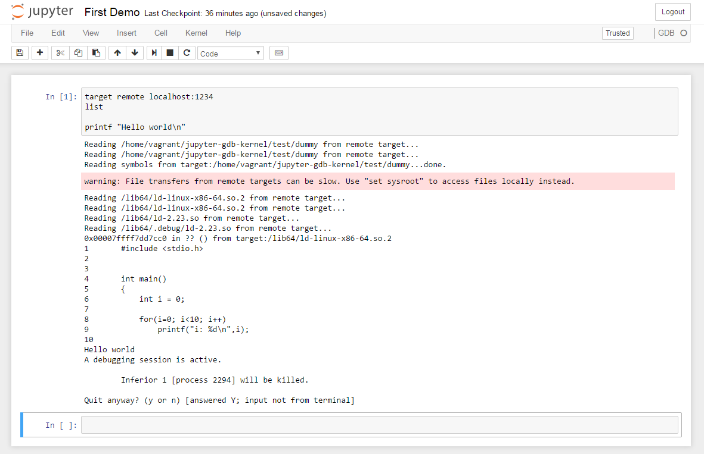

> __DISCLAIMER__
>
> This repo is currently in a very-very alpha stage and only to show the concept

# GDB kernel for Jupyter Notebooks

This kernel can be used to show GDB commands in Jupyter Notebooks. Currently only single lined commands are supported.
Also either a `gdbserver` or access to the notebook server is needed to open a target to debug.

## Installation

Make sure gdb version 7+ is installed on notebook server location

```shell
python3 -m venv venv
pip install -e .
jupyter-kernelspec install spec/kernel.json
```

## Usage

### Create remote debugging target
```shell
gcc test/dummy.c -g -o dummy
gdbserver 0.0.0.0:1234 dummy
```
### Start notebook server
```shell
jupyter notebook --port=8080 --ip=0.0.0.0 --no-browser
```

### Debug from Jupyter

* Connect to remote target
* List source code


## Development

TODO
